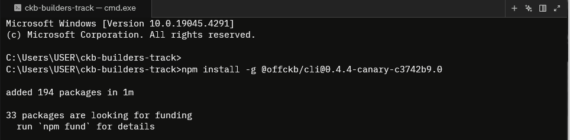

# CKBuilder Track Weekly Report — Week 2
-  Name: **Mayowa Temitope AKINYELE**
-  Week Ending: **Jan 21, 2026**

## Courses Completed
-  Introduction to CKB Script Programing 1: [Validation Model](https://xuejie.space/2019_07_05_introduction_to_ckb_script_programming_validation_model/)
- Introduction to CKB Script Programming 2: [Script Basics](https://xuejie.space/2019_07_13_introduction_to_ckb_script_programming_script_basics/)
- Programming in Rust: [Rust Basics](https://youtu.be/rQ_J9WH6CGk?si=TUeQa1uo3JNJjm1i)
- SDK & Development Tools: [CKB-SDK-Rust](https://docs.nervos.org/docs/sdk-and-devtool/rust)
- NFT Starter course: [Getting starterd with NFTs](https://academy.ckb.dev/courses/nft-getting-started)

## Key Learnings
- How to write a minimal CKB script.
- Always-Success Script vs Always-Failure Script & Why the latter matters
- How NFTs are created and managed on the Nervos Blockchain. 
- CoTA Strengths vs Spore Strengths.

## Brief
- Always-Success scripts always return 0, while always-failure scripts always return non-zero values. The always-failure scripts is used to create an unspendable cell.
```rust
#![no_std]
#![no_main]
// Always Success Script
use ckb_std::entry;

ckb_std::entry!(main);

fn main() -> i8 {
    0 
}
```

```rust
#![no_std]
#![no_main]
// Always Failure Script
use ckb_std::entry;

ckb_std::entry!(main);

fn main() -> i8 {
    1 
}

```
- CoTA is used mostly for while Spores is used mostly for high value digital assets because of its high performance.
- Lock and type scripts share the same deployment model. Only their execution timing is different. It is on creation for the type script while for the lock script, it is on consumption.
- Scripts interact with the blockchain through syscallks and hereby give a sandboxed access to the transaction data.
- The type scripts protect system rules while the lock scripts protect users.
- CKB executes each unique lock script from inputs once, and each unique type script from both inputs and outputs once.
- A real secp256k1 lock extends the functionality of the lock script by adding a signature verification step as follows(```makefile```):

```makefile
tx_hash = load_tx_hash()
pubkey = secp_recover(signature, tx_hash)
hash = blake160(pubkey)
assert(hash == args)
```

## Practical Progress
### Environment setup
I installed the rust compiler and the ```cbk-sdk-rust``` library. After which I went through the ```Rust Programming Books``` to get a hang of the language. You can find my Rust Scratchpad [here](https://github.com/RobaireTH/rust-scratchpad)
 
## Proof of Participation
You can find the proof of participation [here](https://drive.google.com/drive/folders/1x0xVBj2DgR6JmBB6lTCiMpbPUnOgPqFD?usp=drive_link)

## Challenges & Solutions
For the problem I face last week concerning installing the ```offckb-cli```, I went through the Telegram group to see if anyone had faced the same issue. Luckily, [Retric SU](https://github.com/RetricSu) had posted a solution earlier. I followed through and was able to install the canary version of the ```offckb-cli``` using the following command:
```bash
npm install -g @offckb/cli@0.4.4-canary-c3742b9.0
```

