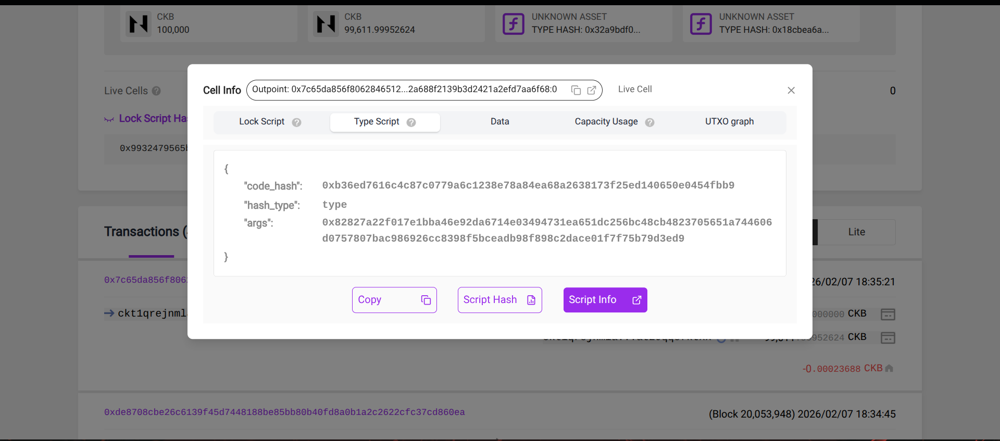
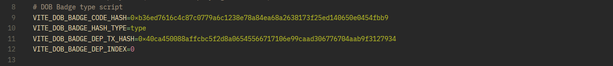

# CKBuilder Track Weekly Report — Week 
-  Name: **Mayowa Temitope AKINYELE**
-  Week Ending: **Feb 11, 2026**
 
## Courses Completed
- [Introduction to sUDT](https://docs-xi-two.vercel.app/docs/rfcs/0025-simple-udt/0025-simple-udt)
- [A practical guide to sUDT](https://github.com/nervosnetwork/ckb-cli/wiki/UDT-%28sudt%29-Operations-Tutorial)
- [Language choice in CKB scriptint](https://docs.nervos.org/docs/script-course/intro-to-script-10)
- [Understanding Nervos DAO](https://messari.io/copilot/share/understanding-nervos-dao-830c1d00-0afc-47aa-a65c-465701adc67f)

## Key Learnings
 - How to create and manage sUDTs using the CKB CLI
 - Understanding the importance of sUDTs in the Nervos ecosystem
 - Choosing the right language for CKB script development
 - The fundamentals of Nervos DAO and its role in the network
 - Best practices for optimizing CKB script performance
 - Debugging and troubleshooting CKB scripts
 
 ## Practical Progress
 - I deployed the HMAC qr helper for ckb-pop and others event observers on fly.io- users sign before event observers recognize them.
 - I deployed the ckb-pop contracts on the testnet(RPC connection).
 - I tested the ckb-pop contracts by minting a badge and debugging the contract, watching the anchor and event handlers.
 - I checked the testnet explorer for the minted badge and it verifies its existence. Also, it's code hash matched the one I have registered upon deployment.
 

 
 ## Proof of Participation
 You can find my progress on the ckb-pop build [here](https://ckb-pop.vercel.app/). To check proofs of my reading or running of tutorials locally, you can check [here](https://drive.google.com/drive/folders/1QiLTn49X1MyxIxdbYpcF-kIcf-XDXM5j?usp=drive_link) or review my [commit history](https://github.com/robaireth/ckb-pop/commits).